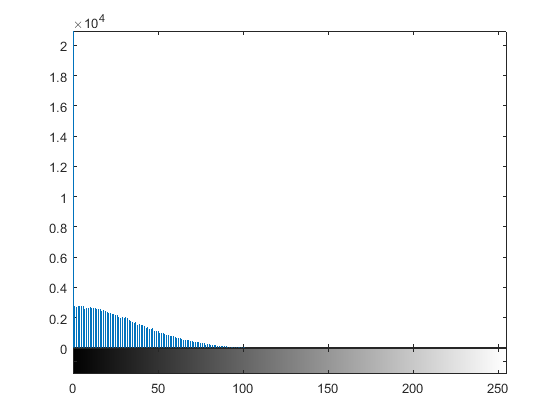
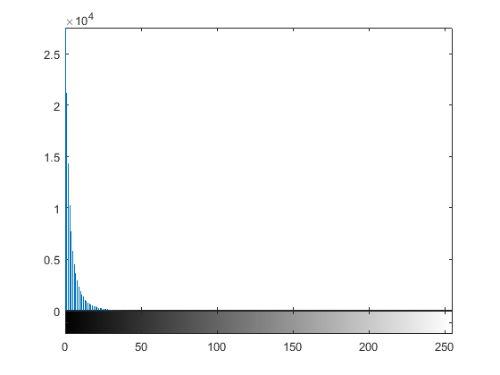

# Matlab图片基本处理操作

## 一、实验名称

使用matlab对图像进行基本处理。

## 二、实验目的

熟悉Matlab编程工具。

## 三、实验过程

测试图像选择灰度图像。

 

1.  模拟数字图像噪声失真

  ）	高斯噪声：添加均值为0，方差为0.01的高斯噪声。			   	

2） 椒盐噪声：添加噪声密度为0.05的椒盐噪声。

 

 

2.	模拟数字图像滤波操作

	1）	均值滤波：默认使用3*3的滤波器。

​    加有高斯噪声的图片滤波后：

 

加有椒盐噪声的图片滤波后:

 

2） 中值滤波

加有高斯噪声的图片滤波后：

 

加有椒盐噪声的图片滤波后：

 

3.	观察分析滤波前后图像统计特征差异

1） 灰度图像直方图

加有高斯噪声的图片灰度图像直方图：

 

 

加有高斯噪声的图片均值滤波后灰度图像直方图：

 

加有高斯噪声的图片中值滤波后灰度图像直方图：

 

加有椒盐噪声的图像灰度图像直方图：

 

加有椒盐噪声的图片均值滤波后灰度图像直方图：

 

加有椒盐噪声的图片中值滤波后灰度图像直方图：

 

 

2） 一阶差分图像直方图

加有高斯噪声的图片的一阶差分直方图：

 

加有高斯噪声的图片均值滤波后的一阶差分直方图：

 

加有高斯噪声的图片中值滤波后的一阶差分直方图：

 

加有椒盐噪声的图片的一阶差分直方图：

 

加有椒盐噪声的图片均值滤波后的一阶差分直方图：

 

加有椒盐噪声的图片中值滤波后的一阶差分直方图：

 

 

## 六、源代码

 

M=imread('goldhill512.bmp');

%加高斯噪声

P1=imnoise(M,'gaussian');

%将图片全屏显示 去白边

imshow(P1,'border','tight','initialmagnification','fit');

set (gcf,'Position',[0,0,500,500]);

axis normal;

%将图像存为bmp格式 

IG = getimage(gcf);

imwrite(IG,'gaussian.bmp');

 

%加椒盐噪声

P2=imnoise(M,'salt & pepper');

imshow(P2,'border','tight','initialmagnification','fit');

set (gcf,'Position',[0,0,500,500]);

axis normal;

imshow(P2);

IS = getimage(gcf);

imwrite(IS,'salt&pepper.bmp');

%默认的噪声密度为0.05

 

%高斯噪声均值滤波

G=imread('gaussian.bmp');

%生成系统预定义的3X3滤波器  

A=fspecial('average'); 

%用生成的滤波器进行滤波  

Y=imfilter(G,A);      

imshow(Y,'border','tight','initialmagnification','fit');

set (gcf,'Position',[0,0,500,500]);

IAFG = getimage(gcf);

imwrite(IAFG,'aver_filter_gaussian.bmp');

 

%椒盐噪声均值滤波

S=imread('salt&pepper.bmp');

%生成系统预定义的3X3滤波器  

A=fspecial('average'); 

%用生成的滤波器进行滤波  

Y=imfilter(S,A);      

imshow(Y,'border','tight','initialmagnification','fit');

set (gcf,'Position',[0,0,500,500]);

IAFS = getimage(gcf);

imwrite(IAFS,'aver_filter_salt.bmp');

 

%高斯噪声中值滤波

g=medfilt2(G);

imshow(g,'border','tight','initialmagnification','fit');

set (gcf,'Position',[0,0,500,500]);

IMFG = getimage(gcf);

imwrite(IMFG,'mid_filter_gaussian.bmp');

 

%椒盐噪声中值滤波

g=medfilt2(S);

imshow(g,'border','tight','initialmagnification','fit');

IMFS = getimage(gcf);

imwrite(IMFS,'mid_filter_salt.bmp');

 

%高斯噪声直方图

imhist(G);

%高斯均值滤波直方图

GauFilterA=imread('aver_filter_gaussian.bmp');

imhist(GauFilterA);

%高斯中值滤波直方图

GauFilterM=imread('mid_filter_gaussian.bmp');

imhist(GauFilterM);

 

%椒盐噪声直方图

imhist(S);

%椒盐均值滤波直方图

SaltFilterA=imread('aver_filter_salt.bmp');

imhist(SaltFilterA);

%高斯中值滤波直方图

SaltFilterM=imread('mid_filter_salt.bmp');

imhist(SaltFilterM);

 

%加有高斯噪声的图片的一阶差分直方图

GauDiff=diff(G,1);

imhist(GauDiff);

%加有高斯噪声的图片均值滤波后的一阶差分直方图

GauAverDiff=diff(GauFilterA,1);

imhist(GauAverDiff);

%加有高斯噪声的图片中值滤波后的一阶差分直方图

GauMidDiff=diff(GauFilterM,1);

imhist(GauMidDiff);

 

%加有椒盐噪声的图片的一阶差分直方图

SaltDiff=diff(S,1);

imhist(SaltDiff);

%加有椒盐噪声的图片均值滤波后的一阶差分直方图

SaltAverDiff=diff(SaltFilterA,1);

imhist(SaltAverDiff );

%加有椒盐噪声的图片中值滤波后的一阶差分直方图

SaltMidDiff=diff(SaltFilterM,1);

imhist(SaltMidDiff);

 

 

七、**遇到的问题******

读取图片后，使用imshow打开的图片再另存为bmp格式，不是真正的灰度图。使用getimage+imwrite实现了灰度图的存储。

 

 
